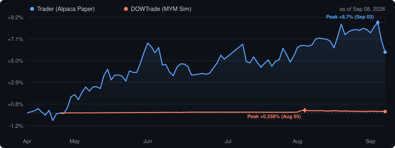

**English** · [繁體中文](README.zh-TW.md)

# Hey, I'm Yu-I 👋

Y1 Electrical Engineering @ [Hanze University of Applied Sciences](https://www.hanze.nl/), Groningen 🇳🇱
**VOL-VCA** (Dutch supervisor-level safety) · APCS · IELTS 7.0 / C1

Taiwanese maker. Embedded firmware, KiCad boards through to bringup, and a small fleet of
self-hosted services on Raspberry Pis in two countries. Most of what's here started as
something breaking and me wanting to know exactly why.

## 🔍 Diagnostic Logs

A symptom, a measurement that contradicts the obvious explanation, then a root cause.
These are the repos I'd point at first.

### [Surviving a flaky USB SSD](https://github.com/Hydr0neFN/rpi4-usb-ssd-resilience)

A Pi 4 crashed whenever the desk was bumped. Four things were wrong and only the first was
obvious: root lived on the removable disk; UAS was bound to an RTL9210B-CG bridge with no
quirks set; USB3 link power management failed on every boot (`enable of device-initiated U1
failed`); and there was nothing in the logs to work from.

That fourth one is what the repo is really about. **There was no evidence, and that was
structural** — the persistent journal was bind-mounted from a directory *on the SSD*, and
`/var/log` is a 50 MB tmpfs. When the disk dropped, the log of the disk dropping died with it.
`journalctl --list-boots` showed a single boot. Months of crashes, zero forensics.

Recovery is now automatic in 22 seconds. Proving that it worked turned up three more bugs,
two of which would have left the machine dead and unreachable.

### [Basil grow box](https://github.com/Hydr0neFN/basil-growbox)

An ESP8266 resetting several times an hour — while **ping kept answering in 1–2 ms through
every failure.** ICMP is answered by lwIP rather than by the sketch's main loop, so a
device that pings back can still be unable to serve a connection. "It responds" was never
sufficient evidence, and I had been treating it as if it were.

Three confident explanations died with evidence: slot contention, connection churn, and a
power sag — that last one excluded by measuring 3.29 V standing on the 3V3 rail. The
trigger is now settled: zero crashes in 23 hours, three in three minutes the moment a
second API client was armed, none after it stopped.

The part I got wrong is the part worth reading. I wrote that heap was excluded, on the
strength of a logged line showing 11.6 kB contiguous at the crash. That line is not a
snapshot — the recorder pairs a fresh reading with a stale one — so **the number I needed
was never actually measured.** The trigger stands; the mechanism is open, and it is
written up that way. The cause was a second API client opening a handshake
while one was already attached — `reset_reason` came back as `Exception`, a firmware fault
rather than a watchdog bite or a brownout.

Instrumenting the device cost ~655 B against 3–4 kB of free heap — close to a fifth of the
headroom. Measuring the edge moved the edge.

### [The Dead Quarter](https://github.com/Hydr0neFN/ili9341-dead-quarter)

A quarter of a cheap 2.8" ILI9341 panel never updates, and every on-screen self-test still
reports **PASS** — because the test draws into the region it then reads back.

The demo is two PlatformIO builds from **one source file on one board**, one broken and one
correct, which isolates the difference to the build configuration rather than to the panel,
the wiring or the library version.

### [Does a static IP actually lower your ping?](https://github.com/Hydr0neFN/hinet-dual-path-probe)

Two ISP account types on one physical line in Taiwan, measured concurrently from a Pi on
that line, on the **UDP path a Source 2 game actually uses** rather than a convenient nearby
DNS server.

The answer is no, and also yes. Median game ping is **identical** between the two accounts.
The entire difference is in the tail: one sample in six spikes past 60 ms on the dynamic
account, against one in 868 on the fixed one. The probe refreshes the published data hourly.

## ⚡ Embedded & Mechatronics

<table>
<tr>
<td width="50%">

### 🐾 [ThermaPaw Smart Pet Door](https://github.com/Hydr0neFN/smart-pet-door)
**Y1 Capstone · Team Lead**

ESP32-C6 + TMC2130 stepper + LD2410 radar + ToF. A thermally sealed motor-driven door
replacing a passive flap to cut HVAC loss. Demoed live, with a real dog.

</td>
<td width="50%">

### 🔌 [USB-C PD LED Controller PCB V2](https://github.com/Hydr0neFN/LightController)
**Full KiCad design-to-bringup**

CH224K PD sink + AP63205 buck + ESP32-C3. Schematic, layout, fab and bringup, driving LED
strips from the smart-home stack.

</td>
</tr>
<tr>
<td width="50%">

### 🌬️ [DucoBox Silent RE](https://github.com/Hydr0neFN/Duco)
**RF reverse engineering · shelved**

ESP8266 + CC1101 at 868 MHz. Captured the ventilation unit's proprietary traffic, then hit
rotating keys on the join handshake — control was never achieved and the build was retired.
Kept because the negative result is the useful part.

</td>
<td width="50%">

### 🌿 [Basil Grow Box](https://github.com/Hydr0neFN/basil-growbox)
**ESPHome · Home Assistant**

Soil moisture, ultrasonic tank depth, a drain-fault latch and a flood interlock. The foil
gnat barrier is perforated rather than solid; whether the soil still dries under it is being
checked against the logged soil voltage, not assumed.

</td>
</tr>
</table>

Also: [ReactionTimeDuel](https://github.com/Hydr0neFN/ReactionTimeDuel) — a four-player
ESP-NOW reaction game with wireless joysticks, selected for the Hanze Open Day.

## 🏠 Smart Home & IoT

Multi-site Home Assistant + UniFi across two continents, self-hosted on single-board
machines with Docker.

| Project | Stack |
|---|---|
| [PCDeskCYD](https://github.com/Hydr0neFN/PCDeskCYD) | ESP32 CYD touchscreen — PC stats, lighting, media control |
| [CO2](https://github.com/Hydr0neFN/CO2) | NeoPixel desk lamp + SCD41 CO₂ + BME280, HomeKit-native |
| [Kitchen](https://github.com/Hydr0neFN/Kitchen) | ESP8266 × 2: LD2410B presence radar → HomeKit + relay |
| [tourplan](https://github.com/Hydr0neFN/tourplan) | Self-hosted group trip date picker, built for the least tech-savvy relative |
| [yt-subtitle-translator](https://github.com/Hydr0neFN/yt-subtitle-translator) | Real-time YouTube subtitle translator (DeepL + Google) |

## 🤖 AI Tooling

I use LLMs as structured thinking partners rather than code generators — chained as
debaters, executors and reviewers, with checks between them. The interesting part isn't the
prompting, it's the harness around it.

| Project | What it does |
|---|---|
| [claude-bridges](https://github.com/Hydr0neFN/claude-bridges) | MCP bridges that let one agent consult others for structured, role-based review |
| [solver-verified-bench](https://github.com/Hydr0neFN/solver-verified-bench) | LLM benchmark where answer keys are data, timeouts count as failures, and the limits are written down |
| [claude-memory-web](https://github.com/Hydr0neFN/claude-memory-web) | Browser UI for a self-hosted memory store — no build step, ETag conflict diffs, git history |
| [trader](https://github.com/Hydr0neFN/trader) · [DOWTrade](https://github.com/Hydr0neFN/DOWTrade) | Two paper-trading bots: multi-model pipelines behind hard-coded Python safety rails, measured against a deterministic control arm |

## 🛠 Tech

**Embedded** · `ESP32` `ESP8266` `Arduino` `PlatformIO` `ESPHome` `KiCad` `RF 868MHz` `MQTT`
**Software** · `C/C++` `Python` `Flask` `FastAPI` `Docker` `HomeKit`
**Design & Infra** · `Fusion 360` `3D Printing` `Home Assistant` `UniFi` `Cloudflare`

## 📍 Background

🇹🇼 Taiwan → 🇩🇪 Exchange year Germany '21–'22 → 🇳🇱 Netherlands

## 📊 Appendix — live telemetry

The two trading bots publish their own numbers below. A cron job on the Pi rewrites this
block on a schedule, so it shows whatever the last run produced.

<!-- LIVE_STATS:START -->
> **Live Stats** · updated 2026-09-21 17:15 ET · *auto-generated by RPi cron*
>
> | | Trader (Alpaca Paper) | DOWTrade (MYM Sim) |
> |---|---|---|
> | Equity | $106,329.73 | $1,001,053.94 |
> | Return | +6.33% | +4.22% |
> | Net P&L | — | $+1,053.94 |
> | Positions | 24/24 | FLAT |
> | Day P&L | $+1,186.07 | — |
> | Total Trades | — | 90 |
> | Top | AMD +21.8%, META +20.1%, TMO +8.4% | |
> | Bottom | CVX -3.0%, KO -2.6%, NOW -2.1% | |
>
> DOWTrade returns are quoted against $25,000 of risk capital, not the sim account's $1M broker fallback — the strategy risks $250 a trade, so a percentage of a million is meaningless.
> Control arm: identical 15m bars, identical 2xATR stop and sizing, with the LLM ensemble replaced by a plain EMA(9/21) cross -> **$-4,656.82 over 233 trades** (24.0% win rate, -0.052R avg). Re-pricing the LLM version under the **same cost model** (one tick of adverse slippage per fill plus commission) gives **$+650.94 over 90 round trips**. The Net P&L row above is as-booked and predates that cost model, which applies to positions opened from 2026-09-09.
> Neither sample is remotely large enough to be significant. This is a direction, not a result.

<!-- LIVE_STATS:END -->

---

*Nearly all of it self-hosted on a single-board computer — because why pay for cloud when a $35 machine will do.*
