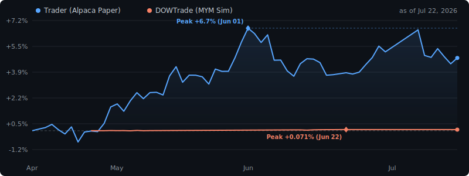

[English](README.md) | **繁體中文**

# 嘿，我是 Yu-I 👋

Hanze 應用科學大學 ([Hanze University of Applied Sciences](https://www.hanze.nl/)) 電機工程大一，Groningen 🇳🇱

來自台灣的 maker，做嵌入式系統、畫 PCB、在 Raspberry Pi 上跑 AI 交易機器人。
AI 是我的能力放大器與思考夥伴，每日學習最新的技術與 AI 進展。

### 思考迴圈

我把 LLM 當結構化思考夥伴，不只是寫 code 的工具。工作流串接 Claude、Gemini、Copilot 等模型，各自擔任辯論者、執行者、審查者，形成多模型互審迴圈。
→ **[claude-bridges](https://github.com/Hydr0neFN/claude-bridges)** — 完整架構與工具鏈。

<!-- LIVE_STATS:START -->
> **即時數據** · 更新於 2026-07-22 03:41 ET · *由 RPi cron 自動產生*
>
> | | Trader (Alpaca 模擬) | DOWTrade (MYM 模擬) |
> |---|---|---|
> | 淨值 | $104,768.78 | $1,000,665.56 |
> | 報酬率 | +4.77% | +0.067% |
> | 持倉 | 20/20 | 空倉 |
> | 當日損益 | $+104,768.78 | — |
> | 總交易次數 | — | 12 |
> | 漲幅前三 | MA +8.1%, BAC +6.1%, V +12.7% | |
> | 跌幅前三 | HD -4.2%, AVGO -1.8%, WFC -0.6% | |

<!-- LIVE_STATS:END -->

## ⚡ 精選專案

<table>
<tr>
<td width="50%">

### 🐾 [ThermaPaw 智慧寵物門](https://github.com/Hydr0neFN/smart-pet-door)
**大一 Capstone · 組長**

ESP32-C6 + TMC2130 步進馬達 + LD2410 雷達 + ToF 感測器。自動寵物門，真的狗勾也會用。

</td>
<td width="50%">

### 🔌 [USB-C PD LED 控制器 PCB V2](https://github.com/Hydr0neFN/LightController)
**完整 KiCad 設計到灌軟體上電**

CH224K + AP63205 + ESP32-C3。可使用智慧家庭生態控制燈條。

</td>
</tr>
<tr>
<td width="50%">

### 🤖 [多模型 LLM 交易機器人](https://github.com/Hydr0neFN/trader)
**跑在 RPi 4B · 模擬交易**

Gemini 分析 → HuggingFace 觀點分析 → Claude 風控閘門 → Alpaca 模擬下單。每 30 分鐘掃 30 支大型股，trailing stop + AI 出場。

</td>
<td width="50%">

### 📈 [DOWTrade](https://github.com/Hydr0neFN/DOWTrade)
**MYM 期貨 · 模擬交易**

三模型管線 (Haiku/Gemini/DeepSeek)，硬編碼安全護欄、SMA 交叉過濾、金字塔加倉模擬成交。FastAPI 儀表板 + LLM 生成每日交易日誌。

</td>
</tr>
<tr>
<td width="50%">

### 🎮 [瞬時對決](https://github.com/Hydr0neFN/ReactionTimeDuel)
**入選 Hanze Open Day 展示**

ESP32 + ESP8266 透過 ESP-NOW 通訊，NeoPixel、I2S 音效、MPU-6050 動作感測。先按者勝。

</td>
<td width="50%">

### 🌬️ [DucoBox Silent 逆向工程](https://github.com/Hydr0neFN/Duco)
**逆向 RF 協定**

ESP8266 + CC1101 868 MHz → 嗅探水表/通風系統專有 RF 訊號 / 讀取全屋使用瓦數

</td>
</tr>
</table>

## 🏠 智慧家庭 & IoT

跨洲 Home Assistant + UniFi 部署（台灣 ↔ Groningen），全跑在一台 RPi 4B + Docker + Cloudflare Tunnel。

| 專案 | 技術棧 |
|---|---|
| [PCDeskCYD](https://github.com/Hydr0neFN/PCDeskCYD) | ESP32 CYD 觸控螢幕 — 電腦數據、燈控、媒體控制 |
| [CO2](https://github.com/Hydr0neFN/CO2) | NeoPixel 檯燈 + SCD41 CO₂ + BME280，原生 HomeKit |
| [Kitchen](https://github.com/Hydr0neFN/Kitchen) | ESP8266 × 2：LD2410B 存在偵測 → HomeKit + 繼電器 |
| [tourplan](https://github.com/Hydr0neFN/tourplan) | 自架旅行日期投票工具，給朋友用 |
| [yt-subtitle-translator](https://github.com/Hydr0neFN/yt-subtitle-translator) | 即時 YouTube 字幕翻譯器（DeepL + Google） |

## 🛠 技術

**嵌入式** · `ESP32` `ESP8266` `Arduino` `PlatformIO` `ESPHome` `KiCad` `RF 868MHz` `MQTT`
**軟體** · `C/C++` `Python` `Flask` `FastAPI` `Docker` `HomeKit`
**設計 & 基礎設施** · `Fusion 360` `3D Printing` `Home Assistant` `UniFi` `Cloudflare`

## 📍 背景

🇹🇼 台灣 → 🇩🇪 德國交換一年 '21–'22 → 🇳🇱 荷蘭

APCS 檢定通過 · VOL-VCA（荷蘭主管級安全證照，10年效期） · IELTS 7.0/C1

---

*所有東西都跑在一台 Raspberry Pi 4B 上 — 有一台 $35 的電腦幹嘛付雲端的錢。*
